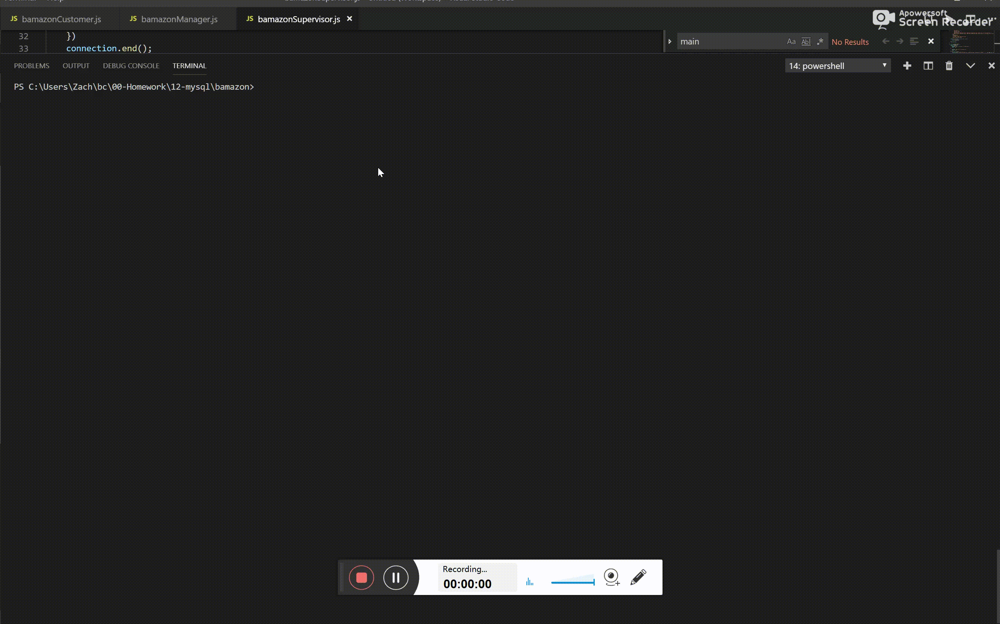
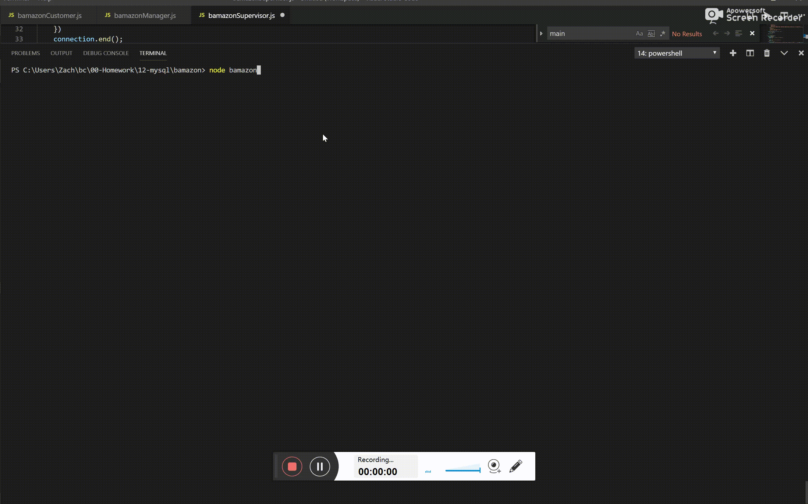
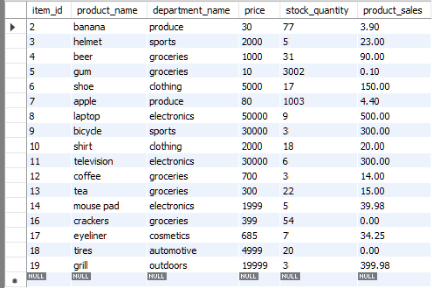
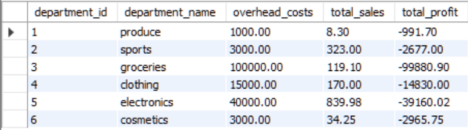

# bamazon

## To run
cd bamazon

npm i

node bamazonCustomer || node bamazonManager || node bamazonSupervisor (depending on which level you want to access)

## Description
A product management interface meant to be used on the CLI.

This project has three different modes: customer, manager, and supervisor.

In the customer mode, you can buy products as demonstrated below. If the customer requests to buy more products than are in stock, an error message is sent.

In the manager mode you can View Products for Sale, View Low Inventory, Add to Inventory, or Add New Product. For view low inventory, any product which 
has less than 5 in stock is displayed. Add to inventory allows you to increase the inventory of existing products, and add new products allows you to add completely new products. This mode is demonstrated below:

In the supervisor mode, you can view an overview of each department and their net income. This is done by joining the products table and the departments table and calculating the total income generated across all departments on the fly, as well as the net income. This mode is demonstrated below, and screenshots of the tables will be displayed below that.

Products Table:

Departments Table:

